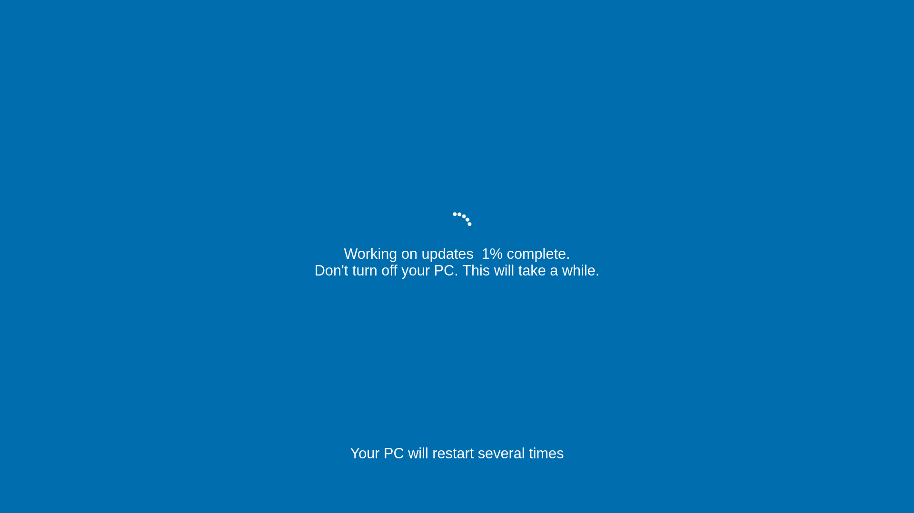

# FakeUpdate

FakeUpdate is a website that provides simulated updates for both Windows 10 and macOS operating systems. The website allows users to simulate a realistic-looking update screen on their computer screen, making it look like they are updating. This can be used as an excuse to explain a delay in work or to take a break without being questioned by a boss or colleague. The website is easy to use and provides a variety of update screens to choose from, making it a fun and harmless way to prank coworkers or to give yourself a break.

Visit: [FakeUpdate](https://H454NSec.github.io/FakeUpdate)

## Windows 10

## MacOS

